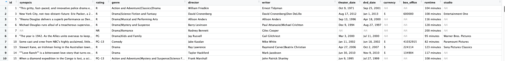

## Welcome to Day 5 of the Summer School!
#### Introduction to Text Mining
---

#### Introduction to regular expressions
- What exactly are regular expressions?
- Strings with a special syntax
- Allow us to match patterns in other strings
- Applications of regular expressions:
  - Find all web links in a document
  - Parse email addresses, remove/replace unwanted characters

---?gist=yanggicane/d4767e2c951e32a8fc48ce43c858c7d0&lang=python&title=Textcode
@[1]()
@[3-4](match..)
@[6](match)
@[8-9](match)
---
@snap[west]
Common Regex patterns
@snapend
<table>
  <tr>
    <th>pattern</th>
    <th>matches</th>
     <th>example</th>
  </tr>
  <tr>
    <td>`\w+`</td>
    <td>word</td>
     <td>'Magic'</td>
  </tr>
  <tr class="fragment">
    <td>`\d`</td>
    <td>digit</td>
     <td>9</td>
  </tr>
  <tr class="fragment">
    <td>`\s`</td>
    <td>space</td>
     <td>' '</td>
   </tr>
  <tr class="fragment">
    <td>`.*`</td>
    <td>wildcard</td>
     <td>'username74'</td>
    </tr>
  <tr class="fragment">
    <td>`+` or `*`</td>
    <td>greedy match</td>
     <td>'bbbbb'</td> 
  </tr>
  <tr class="fragment">
    <td>`\S`</td>
    <td>**not** space</td>
     <td>'no_spaces'</td> 
  </tr>
  <tr class="fragment">
    <td>`[a-z]`</td>
    <td>lowercase group</td>
     <td>'abcdefg'</td>     
</table>
---
#### Common Python re functions
- split: split a string on regex
- findall: find all patterns in a string
- search: search for a pattern
- match: match an entire string or substring based on a pattern
- Pattern first, and the string second
- The output can be an iterator, string, or match object

---?gist=yanggicane/c7bf46b64f37b90933858f48ee593701&lang=python&title=Textcode
@[1](The sample twitter write into Python as a string.)
@[3-9](We split the sample twitter on each sentence ending.)
@[11-13](Find and print all capitalized words in the sample twitter.)
@[15-17](Split the sample twitter on spaces.)
@[19-21](Find all digits in the sample twitter.)

---
#### Cleaning and preprocessing text
- Common steps for preprocessing text includes:
  - Identifies the language
  - Makes all text lowercase
  - Removes number
  - Romoves punctuation like periods and question marks
  -
  - Tokenize
  - Removes specific words(stop words or/and words defined by user)
  - Word Stemming
---
#### Example: Movie Information from Rotten Tomatoes
- This dataset consists of general information about 1560 movies on the Rotten Tomatoes site. 
- There are 12 columns: id, synopsis, rating, genre, director, writer, theater_data, dvd_date, currency, box_office, runtime, and studio.
- We are interested in analyzing the movie synopsis. 
- This dataset is avaiable at Kaggle.com.

---
#### Step 1: Identifies Language
###### What is character encoding?
- Words and sentences in text are created from characters.
- The characters are stored in the computer as one or more bytes.
- ASCII, abbreviated from American Standard Code for Information Interchange, is a character encoding standard for electronic communication.
- The set of 128 (0-127) characters of ASCII contains all you need to write in English language.
- Unicode has a much wider array of characters and ASCII is incorporated into Unicode character set as the first 128 symbols.
- We can use the character encoding for identifying English text, and/or find non-ASCII characters from text.

---?gist=yanggicane/16660e95e110b6afe0e449edbdf02df9&lang=python&title=Textcode
@[1-4](Import data from .csv.)
@[6](Removing missing synopsis.)
@[8-14](Return True/False regarding if the text is English. )
@[16-18](List non-English movie synopsis.)
@[20](What if there is non ASCII characters?)
@[22-25](Convert accent string into ASCII characters only.)

---?gist=yanggicane/6e8eca98efc75b2ab6902f573dbe97f4
@[1-4](Let's use one of the movie synopsis as a example for pre-processing.)
@[6-8](Switch to lower case.)
@[10-12](Remove numbers.)
@[14-16](Load standard punctuations.)
@[18-22](Remove punctuations.)

--- 
@snap[north-west]
#### Tokenization
- The next step is to turn a tring or document into tokens (smaller chunks).
- Here, we will break out by words.
- It will help us to remove unwanted tokens (words).
@snapend

@snap[west]
#### Remove Stop Words
- In NLP, a stop word is a commonly used word (such as "the", "a", "in") which have very little meaning.
@snapend

@snap[south-west]
#### Stemming
- The goal of stemming is to reduce inflectional forms and sometimes derivationally related forms of a word to a common base form. For example:
  - am, are, is $\rightarrow$ be
  - car, cars, car's cars' $\rightarrow$ car
  @snapend
