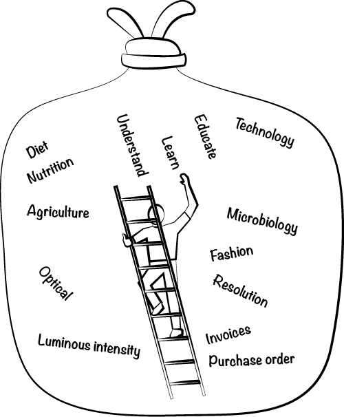
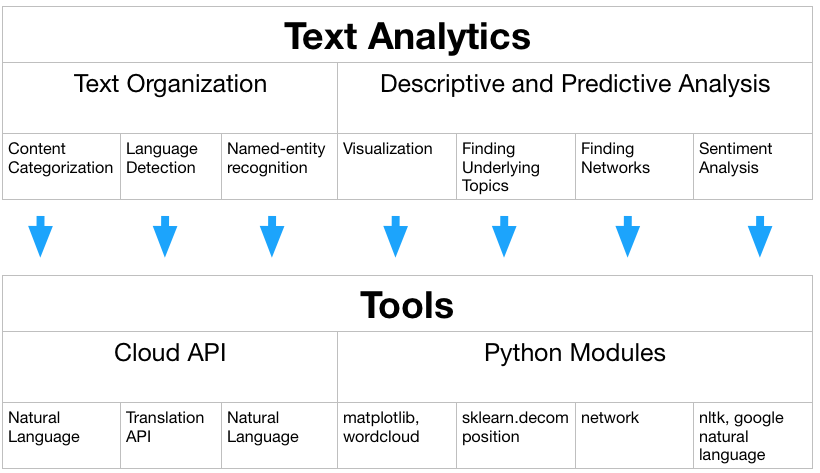
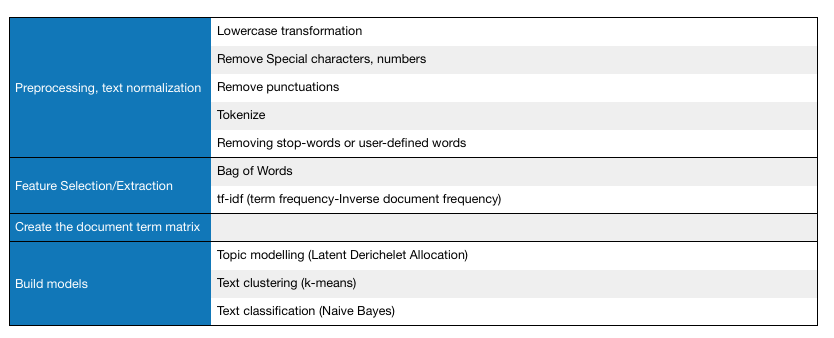
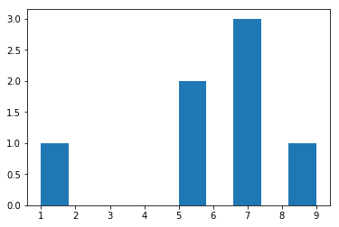
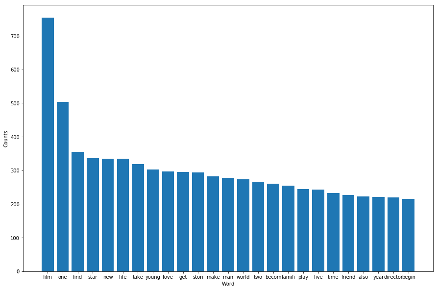

## MacData Summer School Day 5: Introduction to Text Mining
#### Yang Tang, PhD 
@snap[center span-40]

@snapend
@snap[midpoint span-70]

@snapend

---
#### What is text mining?
@ul

- Text mining (also called text analytics) is a method for finding patterns from a large body text. 
- It is a method for gathering structured information from unstructured data. 
- Typical text mining tasks includes
  - Text categorization
  - Entity extraction,
  - Sentiment analysis
  - Topic identification
  - Document summarization
  
- Essentially, we would like to turn text into data for analysis via natural language processing (NLP) and analytical methods.

@ulend

---
#### High-Level Classification of Text Analytics and Tools Avaiable



---?image=assets/img/trans_api.png&size=80% 70%
#### A Sneak Peak of Language Detection/Translation API
---?image=assets/img/entities.png&size=60% 80%
#### A Sneak Peak of Natual Language API
---?image=assets/img/sentiment.png&size=50% 80%
#### A Sneak Peak of Natual Language API
---?image=assets/img/catgories.png&size=80% 30%
#### A Sneak Peak of Natual Language API
---
#### Introduction to regular expressions in Python
- What exactly are regular expressions?
- Strings with a special syntax
- Allow us to match patterns in other strings
- Applications of regular expressions:
  - Find all web links in a document
  - Parse email addresses, remove/replace unwanted characters

---?gist=yanggicane/d4767e2c951e32a8fc48ce43c858c7d0&lang=python&title=Textcode
@[1]()
@[3-4](match..)
@[6](match)
@[8-9](match)
---
@snap[north-west]
Common Regex patterns
@snapend
<table>
  <tr>
    <th>pattern</th>
    <th>matches</th>
     <th>example</th>
  </tr>
  <tr>
    <td>`\w+`</td>
    <td>word</td>
     <td>'Magic'</td>
  </tr>
  <tr class="fragment">
    <td>`\d`</td>
    <td>digit</td>
     <td>9</td>
  </tr>
  <tr class="fragment">
    <td>`\s`</td>
    <td>space</td>
     <td>' '</td>
   </tr>
  <tr class="fragment">
    <td>`.*`</td>
    <td>wildcard</td>
     <td>'username74'</td>
    </tr>
  <tr class="fragment">
    <td>`+` or `*`</td>
    <td>greedy match</td>
     <td>'bbbbb'</td> 
  </tr>
  <tr class="fragment">
    <td>`\S`</td>
    <td>**not** space</td>
     <td>'no_spaces'</td> 
  </tr>
  <tr class="fragment">
    <td>`[a-z]`</td>
    <td>lowercase group</td>
     <td>'abcdefg'</td>     
</table>
---
#### Common Python re functions
- split: split a string on regex
- findall: find all patterns in a string
- search: search for a pattern
- match: match an entire string or substring based on a pattern
- Pattern first, and the string second
- The output can be an iterator, string, or match object

---?gist=yanggicane/c7bf46b64f37b90933858f48ee593701&lang=python&title=Textcode
@[1](The sample twitter write into Python as a string.)
@[3-9](We split the sample twitter on each sentence ending.)
@[11-13](Find and print all capitalized words in the sample twitter.)
@[15-17](Split the sample twitter on spaces.)
@[19-21](Find all digits in the sample twitter.)

---
#### The process flow for text data modelling 


---
#### Example: Movie Information from Rotten Tomatoes
- This dataset consists of general information about 1560 movies on the Rotten Tomatoes site. 
- There are 12 columns: id, synopsis, rating, genre, director, writer, theater_data, dvd_date, currency, box_office, runtime, and studio.
- We are interested in analyzing the movie synopsis. 
- This dataset is avaiable at Kaggle.com.


---?gist=yanggicane/6e8eca98efc75b2ab6902f573dbe97f4
@[1-3](Let's load the movie information from the csv.)
@[5](We will only use the movie discription here.)
@[7](We then delete missing synopsis.)
@[9-12](Let's use one of the movie synopsis as a example for pre-processing.)
@[14-16](Switch to lower case.)
@[18-20](Remove numbers.)
@[22-24](Load standard punctuations.)
@[26-30](Remove punctuations.)

--- 

#### Tokenization
- The next step is to turn a tring or document into tokens (smaller chunks).
- Here, we will break out by words.
- It will help us to remove unwanted tokens (words).
<br/><br/>

#### Remove Stop Words
- In NLP, a stop word is a commonly used word (such as "the", "a", "in") which have very little meaning.
<br/><br/>


#### Stemming
- The goal of stemming is to reduce inflectional forms and sometimes derivationally related forms of a word to a common base form. For example:
  - am, are, is $\rightarrow$ be
  - car, cars, car's cars' $\rightarrow$ car

---?gist=yanggicane/f71fd0b31e91ce624deb44611719b9f1&lang=python&title=CODE
@[1](Import the function to perform word tokenization.)
@[2-49](Return a list of words from the sample text input.)
@[51-52](Define a set of stopwords.)
@[54-83]()
@[85-86]()
@[88-116](Story$\rightarrow$ stori.)

---?gist=yanggicane/e6e12c59e3d5970ebabdf4af358a6394&lang=python&title=NOW LET'S APPLY THE PRE-PROCESSING STEPS TO THE ENTIRE DATASET
@[1-10]()
@[13-15](Convert a collection of text documents to a matrix of token counts.)
@[16-18](Return a dtm with 1498 rows, and 15863 columns (words).)
@[20-26](Compare to the result without stemming.)

---
#### Charting word frequency
- The matplotlib is used by many open source Python projects.
- Straightforward functionality with lots of options.
  @ul
  - Histograms
  - Bar charts
  - Line charts
  - Scatter plots
  - and also advanced functionality like 3D graphs and animations!
  @ulend

---
#### PLOTTING A HISTOGRAM WITH MATPLOTLIB
```Python
from matplotlib import pyplot as plt
plt.hist([1,5,5,7,7,7,9])
plt.show()
```


--- 
#### Charting word frequency
```Python
wordsum=dtm_stem.sum(axis=0)
wordsum=wordsum.sort_values(ascending=False)
plt.figure(figsize=(15,10))
plt.bar(wordsum.index.values[0:25], wordsum[0:25])
plt.xlabel("Word")
plt.ylabel("Counts")
plt.show()    
```

